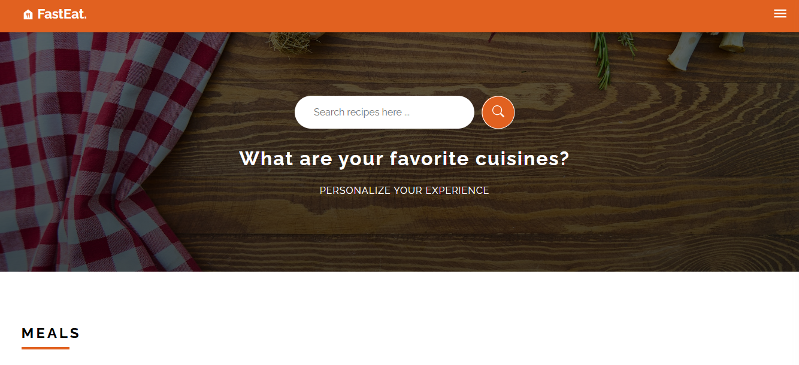
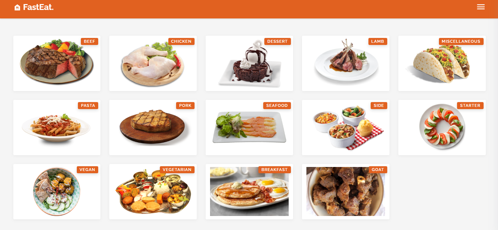

# Food App 🍔  
Built with JavaScript (React.js)

  

## 📌 Project Description  
Food App is a web application that allows users to browse different food items, view detailed information, and manage their favorites.  
It is built using React.js, Context API, and uses modern frontend techniques for a dynamic user experience.

## 🛠️ Features  
- Browse a list of food items with images and descriptions.  
- Search and filter food by categories or name.  
- View detailed information for each food item.  
- Built using React.js with Context API for state management.
  


## 🚀 How to Run  
- Clone the repository:  
   ```bash
   git clone https://github.com/Abdelrhmancs/Food_App.git
